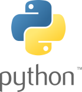
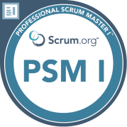
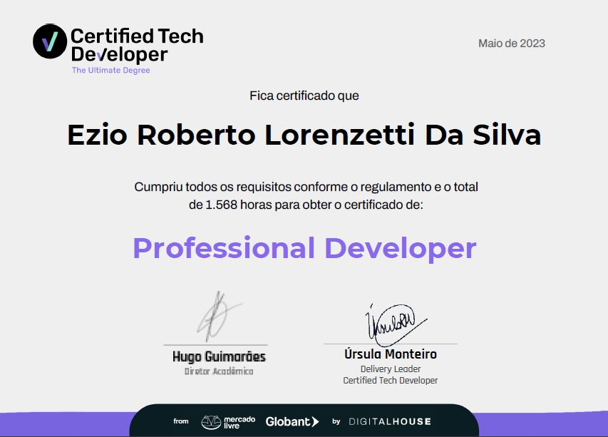

<h2>Olá, seja bem vindo ao meu perfil 👋 </h2>  
 
<h1>
Meu nome é <strong>Ezio R. Lorenzetti</strong> conhecido na internet como <strong>'ezioweb'</strong> 
    
formado e com MBA em Marketing pela <strong>ESPM</strong> e atuando na área desde 1995.     
  
Atualmente fazendo gestão de projetos de desenvolvimento de softwares
</h1>
📡 Sou um jovem de 50 anos apaixonado por tecnologia e quero contribuir por um futuro melhor!!! 💻 
 
🌱 Atualmente estudando desenvolvimento de sistemas na
  
  
  
        
 
⚡ Aprendendo    
  
  &nbsp;&nbsp;&nbsp;&nbsp;&nbsp;&nbsp;&nbsp;
  &nbsp;&nbsp;&nbsp;&nbsp;&nbsp;&nbsp;&nbsp;
  &nbsp;&nbsp;&nbsp;&nbsp;&nbsp;&nbsp;&nbsp;
  &nbsp;&nbsp;&nbsp;&nbsp;&nbsp;&nbsp;&nbsp;
  &nbsp;&nbsp;&nbsp;&nbsp;&nbsp;&nbsp;&nbsp;
  &nbsp;&nbsp;&nbsp;&nbsp;&nbsp;&nbsp;&nbsp;
       

 

📃 Cerfificação em Scrum Master pela [Scrum.org](https://www.scrum.org/)     
📃 Professional Product Owner Accredited Certified pela [AIB Institute](https://www.linkedin.com/company/aib-institute)     
📃 Cerfificação Professional Developr pela [Digital House Brasil](https://www.digitalhouse.com/br)     

    
 
  
 

 
  
 
  

      

🔭 Atualmente trabalho nos projetos:

[Dia da Terra Brasil](https://diadaterra.org) - Webmaster   

[Jardins Comestíveis](https://projetojardinscomestiveis.com.br/) - Webmaster   

[Canal Trilha orgânica](https://www.youtube.com/channel/UCcz5Ubty72K-ExbP62IAJ9w) - Marketing    

[Projeto React](https://organomax-ezioweb.vercel.app/) - Estudos
 

<!--
**ezioweb/ezioweb** is a ✨ _special_ ✨ repository because its `README.md` (this file) appears on your GitHub profile.

Here are some ideas to get you started:

- 🔭 I’m currently working on ...

- 👯 I’m looking to collaborate on ...
- 🤔 I’m looking for help with ...
- 💬 Ask me about ...
- 📫 How to reach me: ...
- 😄 Pronouns: ...
- ⚡ Fun fact: ...
-->

 
<!-- GITHUB STATUS -->

  
  

  <!-- TEMAS: dark, radical, merko, gruvbox, tokyonight, onedark, cobalt, synthwave, highcontrast, dracula -->

 

<!-- TECNOLOGIAS -->

<!-- REDES SOCIAIS -->

<h2>Você pode me encontrar:<h2>
  
    

 

💿🎚📀 Fun fact: Já fui DJ profissional e toquei em festivais como:       

Universo Paralello    

Transformation    

XXXPerience     

Tribe
 

